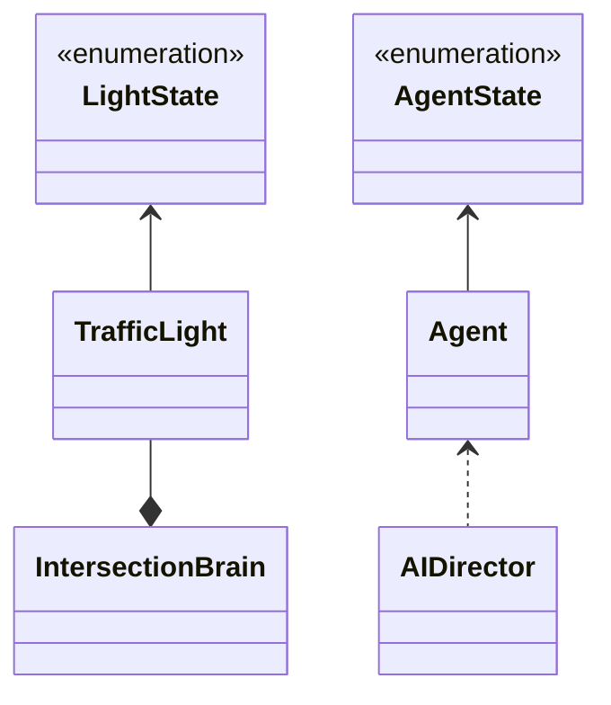

# Sim City

## Autoria

### Elementos do grupo

- Diogo Freire  22104684
- Steven Hall   22001753
  
### Report

#### Diogo Freire

- Código
  - _Agent_:
    - Melhoria do comportamento do agente
    - Sistema de _Waypoints_
    - Deteção de agentes
    - Deteção de Colisões
  - TrafficLight
  - _AIDirector_
- Scene:
  - _NavMesh Bake_
  - _NavMesh Link_
  - _Waypoints_ automóveis e peões
- Relatório:
  - Conclusão
  - Verificação ortográfica
- _Bug fixing_  

#### Steven Hall

- Código:
  - Agent organization
  - Implementação de FSM
  - AgentState enum
  - _AIDirector_
  - TrafficLight System implementation:
    - _IntersectionBrain_
    - _LightState enum_
    - _TrafficLight_
    - _AIDirector_
    - _CarTrigger_
  - UI:
    - Contador de Agentes (canto superior direito)
  - _Bug fixing_
  
- XML:
  - _IntersectionBrain_
  - _TrafficLight_
  - _LightState enum_
  - _UI_
  - _CarTrigger_
  - _CellType_
  - _PlacePopulation_

- Scene
  - Posicionamento de sinais de trânsito, transição de cor, _colliders_ e locais de destino.

- Relatório:
  - Artigos
  - Estado da Arte
  - Metodologia
    - Imagens e explicação
  - _UML_
  - Diagramas _FSM_

## Introdução

 O projeto desenvolvido retrata um modelo tráfego urbano """ . Foi desenvolvido utilizando o motor de jogo [_Unity Engine_ 2022.3.1 _LTS_](https://unity.com/releases/editor/whats-new/2022.3.1#release-notes) e para definir as ações dos agentes, utilizamos as FSM (finite-state machine) [[1]](https://nunofachada.github.io/libgameai/api/LibGameAI.FSMs.html) e o objetivo principal foi demonstrar as técnicas de Inteligência Artificial em uma espécie de _Sim City_ não jogável, com automóveis, peões e sinais de trânsito como semáforos (sinalização luminosa).

Para a construção do ambiente, foi utilizado um _asset pack_ de uma cidade pré-feita que inclui semáforos, estradas, locais como supermercados, hotéis, cafés e mais. A cidade é constituída por diversos destinos acessíveis pelos agentes através de _Pathfinding A*_ gerado pelo _Unity NavMesh_. Utilizamos este componente para gerar um [_bake_](#bake) na cidade, isto é, uma rede tanto para os veículos como para os pedestres, que define o caminho que os agentes podem utilizar para chegar ao seu destino.

A pesquisa para este projeto incluiu uma análise e estudo de trabalhos no campo da simulação de tráfego, mas com cenários, propostas, abordagens e problemas diferentes. O principal foco, além de serem simulações no campo de tráfego, é compreender as limitações de nossa simulação e identificar o que outros trabalhos conseguem fazer melhor. Além disso, visa entender o uso de técnicas de inteligência artificial, comportamentos de agentes e a melhor gestão de tráfego. A principal plataforma de pesquisa foi o _Google Scholar_, sendo as demais fontes essenciais para a construção do código e cenário da simulação desenvolvida.

- Objetivos desta simulação:
  - Fazer com que os automóveis respeitem as regras de trânsito, como sinais luminosos, passadeiras e outros veículos na via.
  - Permitir que os peões utilizem passeios e as passadeiras quando o sinal luminoso permitir.
  - Simular acidentes entre agentes.
  - Implementar um modo de descontrole (caos) que escolhe um agente aleatório e aumenta o seu nível de "insanidade".
  
- Objetivos alcançados:
  - Implementação de sinais luminosos que transacionam entre verde e vermelho utilizando uma máquina de estado ([_FSM_](#agentes-móveis)).
  - Transição entre estado de agentes (automóveis e peões) que implementa uma máquina de estados([_FSM_](#agente-fixo-semáforo)).
  - Obedecer regras de trânsito
  - Estado descontrolo (caos)
  
## Estado da Arte

Nesta secção, será apresentada uma pesquisa sobre simulações relacionadas ao nosso projeto, na qual faremos uma resumida descrição de cada uma e as compararemos com o nosso trabalho desenvolvido ao fazer uma análise de onde há semelhanças como diferenças entre as simulações.

### **_Traffic3D: An Open-Source Traffic-based Interactive Framework to Train AI Agents_**

Este artigo analisa, demonstra e explica o uso e as possibilidades com _Traffic3D_, uma poderosa ferramenta capaz de testar, treinar agentes e exportar os dados para o mundo real. Este simulador visa aprimorar a autenticidade de simuladores de tráfego, melhorar congestionamentos e, como referido anteriormente, treinar agentes. Este simulador é também uma ferramenta [_open source_](https://en.wikipedia.org/wiki/Open_source) que pode ser mais facilmente adaptada às necessidades do usuário.

O objetivo deste artigo é demonstrar as capacidades de _Traffic3D_, bem como salientar a sua aplicação no mundo real. O simulador pode ser utilizado para diversos fins a nível de tráfego, promovendo um nível elevado de realismo.

**Comparação entre projetos**:

  Deteção de objetos

  Ambos os projetos visam melhorar a percepção de veículos controlados por I.A, porém a forma realizada neste trabalho é demonstrar o uso de câmaras ou sensores (no mundo real) bem como o seu uso pode detetar obstáculos e demonstrar o pathfinding adaptavido do I.A. no seu percurso. O nosso trabalha implementa uma I.A. mais simples, com um pathfinding em malha pré-definido pois, o seu destino pode ser aleatório, mas o caminho possui sempre as mesmas regras.

- **Parametrização da Simulação**
  
  Ambos os projetos permitem a edição de parâmetros relevantes à simulação. Tanto o nosso projeto quanto o projeto em análise possibilitam povoar o cenário da simulação com tráfego multimodal, ou seja, tráfego de veículos e pedestres, além de posicionar a posição de instanciação dos agentes móveis (criar agentes em um local pré-definido). Entretanto, _Traffic3D_ avança ainda mais e oferece múltiplas opções de parametrização:

  - Peões: alterações principalmente a nível estético, como género, idade e aparência (roupas dos pedestres). Há também outras parametrizações, como andar ou correr, e comportamentos, como esperar em sinais vermelhos, atravessar nos sinais verdes e atravessar a rua em locais não designados para peões. Este poderoso simulador permite ainda estender os comportamentos e funcionalidades dos peões.

  - Veículos: Existem diversos tipos de veículos nesta simulação, incluindo civis, de emergência, táxis e autocarros. Também é oferecida a opção para os veículos escolherem a condução pelo lado esquerdo ou direito da estrada, o que é relevante para países que conduzem pelo lado esquerdo, como a Inglaterra, entre outros. Estas parametrizações não estou disponíveis na nossa simulação ou são mais simples como no caso de apenas termos um tipo de carro e um peão.

- **Componentes da simulação**:
  
  _Traffic3D_ possui diversas características semelhantes ao _engine_ utilizado no nosso projeto, que permitem fazer o cenário da simulação parecer o mais realista possível, incluindo: iluminação global em tempo real, luzes, sombras, texturas e objetos nativos como veículos, céu e edifícios. Portanto, é possível inferir que ambas as simulações têm componentes visuais bastante semelhantes.
  
    Alguns componentes importantes presentes no artigo referem-se às capacidades do Traffic3D, como a geração procedural que permite importar e criar cenários realistas com maior fidelidade. Essa versatilidade reduz o tempo necessário para os pesquisadores. Outro aspeto relevante que diferencia essa simulação da nossa é o fato de o Traffic3D oferecer um sistema abrangente e rigoroso para treinar agentes autónomos a lidar com uma variedade de cenários. Em nossa simulação, não há aprendizado por parte dos agentes, e também não implementamos condições meteorológicas como neve ou chuva.

    Alguns componentes importantes presentes no artigo referem-se às capacidades do Traffic3D, como a geração procedural que permite importar e criar cenários realistas com maior fidelidade. Essa versatilidade reduz o tempo necessário para os pesquisadores. Outro aspeto relevante que diferencia essa simulação da nossa é o fato de o Traffic3D oferecer um sistema abrangente e rigoroso para treinar agentes autónomos a lidar com uma variedade de cenários. Em nossa simulação, não há aprendizado por parte dos agentes, e também não implementamos condições meteorológicas como neve ou chuva.

    O artigo menciona o treinamento de agentes móveis, mas vale ressaltar que em nossa simulação não realizamos esse tipo de treinamento. No entanto, o artigo explora outra abordagem, focando em agentes fixos, como semáforos. Além disso, a simulação implementou um sistema baseado em _deep reinforcement learning_ para otimizar semáforos no mundo real, evitando congestionamentos com base no treinamento obtido dentro da simulação. [[2]](https://papers.ssrn.com/sol3/papers.cfm?abstract_id=4015243)

### **_Unity based Urban Environment Simulation for Autonomous Vehicle Stereo Vision Evaluation_**

Este estudo explora o desenvolvimento e experimento de uma simulação 3D no _Unity Engine_ para testar veículos  veículos autónomos registarem registarem dados com _stereo cameras_ representados nesta simulação por câmaras do próprio _engine_ situadas na frente do veículo. O objetivo deste experimento é demonstrar as capacidades de um veículo autónomo equipado com sensores(_omnipresent stereo cameras_). A terceira câmara ou a câmara central é bastante interessante porque, faz uso de um shader chamado _Z-buffer_ para representar a gravação de dados em profundidade.

**Comparação entre projetos :**

[[2]](https://ieeexplore.ieee.org/abstract/document/8756805)

### **_Unity 3D Simulator of Autonomous Motorway Traffic Applied to Emergency Corridor Building_**

Este trabalho aborda o desenvolvimento de um simulador de tráfego numa auto-estrada com veículos autónomos, ...  O objetivo é de demonstrar a eficácia de agentes autónomos em certos cenários e permitir com mais sucesso e mais rapidamente a chegada de equipas de emergência ao local de acidentes em auto-estradas e a formação automática de um corredor de emergência.

A principal diferença ou inovação entre este projetos e outros é o facto deste focar-se na construção de uma faixa de emergência em auto-estradas realizada por veículos autónomos e assim Demonstrar a eficácia de veículos autónomos em situações de emergência e intenso trânsito.

**Comparação entre projetos** :

- **Abordagem e objetivos**:  

  Ambos as simulações procuram melhorar simulações de tráfego, segurança rodoaviária e são implementadas em _Unity 3D_. Entretanto o nosso projeto implementa uma abordagem que foca em simular comportamentos de tráfego de veículos e peões, suas respetivas interações como deteção de agentes móveis(carros e peões), agentes fixos (sinais luminosos) e finalmente terem uma ação designada em caso de acidentes num cenário urbano. Enquanto este trabalho desenvolveu um sistema focado em segurança rodoviária mas, mais especificamente em auto-estradas e com veículos puramente autónomos com o fim de otimizar a segurança de todoos e como consequência disto, a formação de um corredor emergência. Devido a isto os serviços de emergencia podem chegar mais rapidamente ao local do acidente.  
  
  Para efetuar a sua abordagem utiliza veículos autónomos capazes de se comunicarem com o objetivo de regular a velocidade dos agentes, criar faixas de emergência, procurando assim garantir ao máximo possível a segurança em auto-estradas para todos.

- **Comunicação entres veículos**
  
  Apesar de nossa a simulação os agentes representarem veículos controlados por pessoas, na prática são veículos autónomos que utilizam I.A. para realizar as suas devidas ações pré-programadas assim como os veículos autónomos analisados neste artigo. Entretanto, estes possuem um sistema mais complexo capaz de realizar uma faixa de emergência como descrito acima. No nosso projeto os veículos utilizam um sistema de coumunicação com outros veículos a sua frente com o objetivo de abrandar a sua velocidade ao igualar a sua própria velocidade ao veículo que está a sua frente. Este sistema utiliza 2 _Box Colliders_ colocados a frente do veículo que detetam se há um veículo a frente, havendo assim uma comunicação entre veículo da frente com o de trás. Esta comunicação também acaba por ser semelhante a vida real, pois se estamos a conduzir e verifica-se um veículo a abrandar (acionar luzes de travão), procedemos a abrandar a nossa velocidade.

  A comunicação entre agentes neste trabalho é capaz de enviar uma menssagem a todos os veículos na sua zona e assim, cada veículo irá tentar tomar a ação correta de acordo com a situação. Uma possível situação é receber a informação que existe um acidente numa faixa em sentido oposta numa auto-estrada e assim não fará sentido abrandar, parar e formar um corredor de emergência, pois este veículo não se qualifica para tomar tais decisões devido ao facto de com a informação presente no momento, não haver um perigo no seu sentido da auto-estrada. [[3]](https://www.researchgate.net/profile/Jurij-Kuzmic/publication/341470027_Unity_3D_Simulator_of_Autonomous_Motorway_Traffic_Applied_to_Emergency_Corridor_Building/links/60119d42299bf1b33e2d26f5/Unity-3D-Simulator-of-Autonomous-Motorway-Traffic-Applied-to-Emergency-Corridor-Building.pdf)
  

   IMPORTANTE PARA ENTENDER QUE CARROS TEM DE SE COMUNICAR E ISSO O MESMO NO MUNDO REAL 

## Metodologia

A simulação desenvolvida é em 3D e as técnicas de Inteligência Artificial utilizadas foram, respetivamente, _FSM's_ (uma biblioteca essencial para a realização de transições entre estados) e _A* (Unity NavMesh)_, que é essencial para o _Pathfinding_ de agentes como carros e peões.

### Controlos da simulação

Os seguintes comandos são representados por teclas (teclado):

- Mover para frente: **W**
- Mover para esquerda: **A**
- Mover para trás: **S**
- Mover para direita: **D**

O seguinte comando é realizado através de um rato

- Rodar câmara: mover rato

### Elementos visuais

Na simulação existem também elementos visuais (_UI_) como informação e ações.

- **Informação**
  
  Para informar o número de agentes ativos, existe portando, um contador no canto superior direito com o número total de peões e carros ativos na simulação.

  

- **Ação**
  
  No campo das ações existem 2 ações possíveis, sendo estas respetivamente aumentar a probabilidade de um carro em modo caos, como também aumentar essa probabilidade no peão.

  Para utilizar estas ações, o utilizador deverá clicar com o botão: **rato esquerdo** no botão desejado para ativar a sua respetiva funcionalidade.

  

### Diagramas _FSM_

#### Agentes móveis

As imagens nesta secção apresentam visualmente o código desenvolvido para efetuar as transições e estados tanto de agentes móveis (carros e peões) como também agentes fixos (sinais luminosos de transito)

Os agentes móveis alternam entre 3 estados, sendo eles respetivamente:

- **_Idle_**: neste estado, o agente fica invisível, aguardando até o momento em que deve sair deste estado.
- **_Move_**: este estado é responsável por fazer o agente prosseguir até o seu destino e fazer a verificação se chegou. Caso tenha chegado, volta ao estado anterior (_Idle_).
- **_Acidente_**: O estado final desta máquina de estados define as ações a serem tomadas em caso de acidente, sendo estas mudar a cor do agente envolvido para vermelho e parar por completo o seu movimento. O agente regressa ao estado anterior (_Move_) ao fim de um determinado tempo.

#### Agente Fixo (semáforo)

s agentes fixos alternam apenas entre dois estados: vermelho e verde. Estes estados definem qual agente pode prosseguir com seu destino atual

O estado inicial de um semáforo pode ser tanto verde quanto vermelho, mas, para demonstrar um possível ponto de origem, definimos o estado _Green_ como inicial a título de exemplo.

  
### Carros

Agentes móveis

O carro é integrado por componentes como [_NavMeshAgent_](https://docs.unity3d.com/560/Documentation/Manual/class-NavMeshAgent.html), [_Rigidbody_](https://docs.unity3d.com/560/Documentation/Manual/class-Rigidbody.html) e [Box colliders](https://docs.unity3d.com/560/Documentation/Manual/class-BoxCollider.html) para garantir o seu funcionamento respetivamente a nível de _pathfinding_, colisões e deteção de outros componentes ou objetos na simulação.

O carro possui movimento dinâmico.

### Peões

Assim como os carros, os peões possuem os mesmos componentes descritos na secção: [Carros](#carros) com exatamente os mesmos objetivos.

A principal diferença entre peões e carros é que peões utilizam o movimento cinemático.

### Semáforos (sinais luminosos)

Os semáforos são agentes fixos na simulação alternando apenas entre 2 estados, verde e vermelho. O seu estado inicial é definido no próprio _gameObject_ . Estes estados alternam os estados de 2 _colliders_. Quando o estado é vermelho, o _collider_ de carros passa a estar ativo enquanto, o _collider_ de peões é desativo e assim vice-versa.

Como referido, existem 2 tipos de _colliders_ numa interseção, sendo demonstrados a título de exemplo na seguinte imagem.

- **_Collider_ Vermelho**: _collider_ para veículos que quando detetado impede a passagem de veículos na mesma faixa.

- **_Collider_ Verde**: _collider_ para peões que quando detetado impede a passagem de um peão na passadeira.

### _Traffic Light_

Cada semáforo na simulação contém um componente _Traffic Light_, responsável por guardar o _LightState_ (estado de luz atual) e ativar e desativar _colliders_ como referido anteriormente.

É possível editar alguns parâmetros como:

- **_Light Mat_**: guarda os materiais (serve apenas para efeitos visuais da simulação).  
  
- **_Start Light State_**: define o estado de luz inicial de cada semáforo.
  
- **_Cross Walk Colls_**: guarda os _colliders_ de peões.

- **_Car Colls_**: guarda os _colliders_ de veículos.

### _Intersection Brain_

Existe apenas 1 "cérebro" por interseção e este componente é responsável pelo tempo (tempo do temporizador em segundos) para mudar o estado dos sinais.

Possui valores parametrizáveis como:

- **_Light Max Time_**: responsável por definir o tempo (em segundos) de transição do estado dos semáforos.
  
- **_Control Points_**: define cada semáforo na atual interseção.

Exemplo de uma interseção com 4 conexões, isto é um componente _Intersection Brain_ com 4 componentes
_Traffic Light_ e os seus respetivos _colliders_.

### Passadeiras

Um sistema a parte dos componentes _Traffic Light_ e _Intersection Brain_ é um _collider_ responsável por detetar se há um peão na passadeira ou não. Isto é importante para os veículos poderem parar em zonas onde não existem semáforos.

### _Bake_

O exemplo a seguir demonstra um _bake_ realizado em uma interseção da cidade, permitindo que os agentes utilizem _Pathfinding_ para alcançar seus destinos.

Zona azul: representa a zona em que peões podem se deslocar.

Zona roxa: demonstra a zona onde os veículos podem transitar.

Zona _Off-Mesh Link_: mostra uma zona de conexão para veículos.

### AI Director

É um _Game Object_ que permite o controlo sobre certos aspetos da simulação. Aqui é permitido que a simulação seja personalizada com parâmetros ajustáveis, sendo estes respetivamente:

- Carros
  - **_Cars_**: número de veículos a serem instanciados no início da simulação.
  - **_Car Spawn points_**: Lista de posições onde carros serão instanciados no início da simulação.
  - **_Car Time Stopped_**: tempo máximo (segundos) para veículo estar estacionário no seu destino
  - **_Cars_**: _prefab_ de veículo a ser instanciado

- Peões
  - **_Peds_**: número de pões a serem instanciados no início da simulação.
  - **_Ped Spawn points_**:Lista de posições onde peões serão instanciados no início da simulação.
  - **_Ped Time Stopped_**: tempo máximo (segundos) para peão estar parado no seu destino
  - **_Ped_**: _prefab_ de peão a ser instanciado.

- Acidente
  - **_Max Time In Accident_**: tempo máximo (segundos) em que agente pode estar em modo acidente.
  
- Caos
  - **_Max Time in Chaos_**: tempo máximo (segundos) em que agente pode estar em modo caos
  - **_Chaos Chance_**: probabilidade de um agente começar em modo caos.
  

### Diagrama UML

O seguinte diagrama contém apenas os algoritmos mais significativos e desenvolvidos pelo [autores](#autoria) deste projeto

## Resultados e discussão

Ao analisar a simulação, é possível observar que os agentes se deslocam para os seus alvos. Os semáforos (sinal luminoso) podem impedi-los de avançar e, se houver uma passadeira, os pedestres podem prosseguir, caso esta seja a situação na zona da simulação.

Os artigos contribuiram a percepção de simulações de tráfegos, dando ideias a futuros trabalhos como termos uma sistame de comunicação mais complexo e a deteção de agentes serem mais realistas.

Alguns objetivos não foram alcançados bem como uma alta realidade da simulação.

## Conclusões

Para concluir, o projeto desenvolvido consistiu em implementar uma simulação de trânsito com automóveis, peões e sinais luminosos. Os resultados obtidos na simulação foram:

- Respeito pelas regras de trânsito
- Uso com sucesso do NavMesh Link para cruzamentos
- Transições do estado dos agentes
- Alterações de estados os agentes a meio do programa
- Múltiplos locais como destino
- Escolha aleatória dos locais para destino
- Desaparecimento visual do agente, porem este mantém-se na cena

## Referências

### IAs generativas

O uso de IAs generativas foi usado e neste tópico explicaremos como:

- O _Chat Bing_ (_Chat GPT-4_) foi utilizado para tirar dúvidas e explicar itens da [documentação](https://learn.microsoft.com/en-us/dotnet/api/?view=netstandard-2.1) de forma mais clara e simples, erros, exemplos e também para obter de forma mais rápida _links_ com código útil, mas nunca diretamente utilizado no código do projeto.

A realização deste projeto consistiu essencialmente em pesquisa própria, conhecimento adquirido por meio de trabalhos e ensino fornecido por professores em diversas unidades curriculares lecionadas na [licenciatura de Videojogos](https://www.ulusofona.pt/lisboa/licenciaturas/videojogos).

### Código, tutoriais, planeamento utilizados e pesquisa

Technologies, U. (n.d.). Unity - Scripting API: Random.Range. <https://docs.unity3d.com/ScriptReference/Random.Range.html>
  
Sunny Valley Studio. (2020, August 26). Project setup - City Builder Unity tutorial P3 [Video]. YouTube. <https://www.youtube.com/watch?v=uBWEjqtdcgM>

Kink3d. (n.d.). GitHub - Kink3d/SimpleTraffic: A simple traffic simulation using Unity’s Nav Mesh Components. GitHub. <https://github.com/Kink3d/SimpleTraffic?tab=readme-ov-file>

Mike, V. a. P. B. (2012, October 1). SimCity: traffic system, public transportation and international airports. Simcitizens. <https://simcitizens.com/simcity-traffic-system-public-transportation-and-international-airports/>

Technologies, U. (n.d.-a). Unity - manual: making an agent patrol between a set of points. <https://docs.unity3d.com/560/Documentation/Manual/nav-AgentPatrol.html>

### _Assets_ de terceiros
  
SimplePoly - Town Pack | 3D Environments | Unity Asset Store. (2024, January 7). Unity Asset Store. <https://assetstore.unity.com/packages/3d/environments/simplepoly-town-pack-62400>

O pacote acima disponibiliza um controlo de câmara (_fly over_) sendo utilizado no projeto.

HD Low Poly Racing Car No.1201 | 3D Land | Unity Asset Store. (2024, March 16). Unity Asset Store. <https://assetstore.unity.com/packages/3d/vehicles/land/hd-low-poly-racing-car-no-1201-118603>
