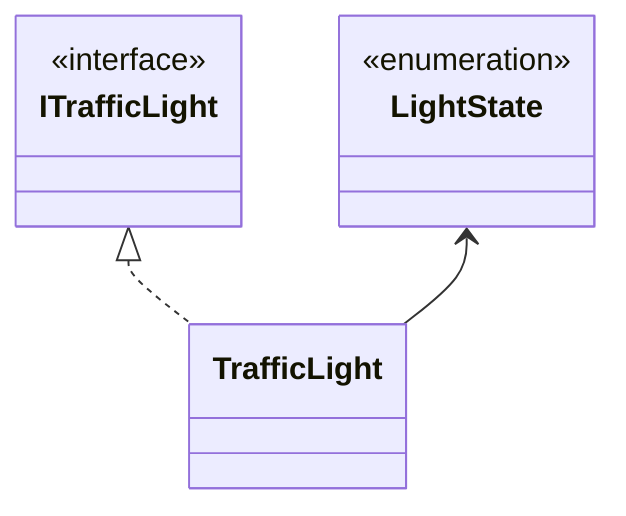

# Sim City

## Autoria

### Elementos do grupo:
- Diogo Freire  22104684
- Steven Hall   2200173
  
### Report:
#### Diogo Freire:
- _Bug fixing_  

#### Steven Hall: 
- Código 
  - Agent
  - Car 
  - TrafficLight System:   
    - LightState enum
    - TrafficLight class
    - ITrafficLight interface
  - UI
  - 
- Relatório
  - UML 
  
- _Bug fixing_

## Introdução

- O projeto desenvolvido constitui uma Simulação de automóveis e peões numa cidade fictícia. Desenvolvido utilizando o motor de jogo [_Unity Engine_ 2022.3.1 _LTS_](https://unity.com/releases/editor/whats-new/2022.3.1#release-notes) 
 Objetivo principal foi demonstrar as técnicas de Inteligencia artificial num _sim city_ não jogável com automóveis, peões e sinais de trânsito (sinalização luminosa). 

### IAs generativas
  O uso de IAs generativas foi usado e neste tópico explicaremos como: 
- O _Chat Bing_ (_Chat GPT-4_) foi utilizado para tirar dúvidas e explicar itens da [documentação](https://learn.microsoft.com/en-us/dotnet/api/?view=netstandard-2.1) de forma mais clara e simples, erros, exemplos e também para obter de forma mais rápida _links_ com código útil.

## Estudo da Arte
_SimCity_   Tropico 4

- Referência 
## Metodologia

### Diagrama _UML_

## Resultados e discussão

## Conclusões

  
A Realização deste projeto consistiu essencialmente em pesquisa própria, conhecimento adquirido por trabalhos e ensino fornecido por proferessores em diversas unidades curriculares lecionadas na [licenciatura de Videojogos](https://www.ulusofona.pt/lisboa/licenciaturas/videojogos).

## Referências

### Código, tutoriais, planeamento utlizados e pesquisa:

Technologies, U. (n.d.). Unity - Scripting API: Random.Range. https://docs.unity3d.com/ScriptReference/Random.Range.html
  
Sunny Valley Studio. (2020, August 26). Project setup - City Builder Unity tutorial P3 [Video]. YouTube. https://www.youtube.com/watch?v=uBWEjqtdcgM

Kink3d. (n.d.). GitHub - Kink3d/SimpleTraffic: A simple traffic simulation using Unity’s Nav Mesh Components. GitHub. https://github.com/Kink3d/SimpleTraffic?tab=readme-ov-file

Mike, V. a. P. B. (2012, October 1). SimCity: traffic system, public transportation and international airports. Simcitizens. https://simcitizens.com/simcity-traffic-system-public-transportation-and-international-airports/

### _Assets_ de terceiros:
  
SimplePoly - Town Pack | 3D Environments | Unity Asset Store. (2024, January 7). Unity Asset Store. https://assetstore.unity.com/packages/3d/environments/simplepoly-town-pack-62400

School bus, simple, isometric | 3D Land | Unity Asset Store. (2020, November 16). Unity Asset Store. https://assetstore.unity.com/packages/3d/vehicles/land/school-bus-simple-isometric-106250

HD Low Poly Racing Car No.1201 | 3D Land | Unity Asset Store. (2024, March 16). Unity Asset Store. https://assetstore.unity.com/packages/3d/vehicles/land/hd-low-poly-racing-car-no-1201-118603

#
  
chegar
Inbuilding => desativa mesh e inicia um temporizador

Moving => deslocar-se (peões feito)

descontrolo=> clica numa tecla (desrespeita os sinais e aumenta a velocidade) so pode entrar se estiver em moving manter durante tempo aleatorio 

acidente piscar

