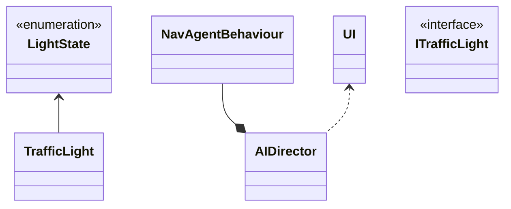

# Sim City

## Autoria

### Elementos do grupo

- Diogo Freire  22104684
- Steven Hall   2200173
  
### Report

#### Diogo Freire

- Código
  - NavAgentBehaviour:
    - Melhoria do comportamento do Agent
  - TrafficLight
  - AIDirector
- Scene:
  - _NavMesh Bake_
  - _NavMesh Link_
  - _Waypoints_ automóveis e peões
- Relatório:
  - Conclusão
  - Verificação ortográfica
- _Bug fixing_  

#### Steven Hall

- Código:
  - Implementação de FSM
  - AgentState enum
  - IAgent interface
  - TrafficLight System implementation:
    - LightState enum
    - TrafficLight
  - UI
  - AIDirector
- Scene
  - Posicionamento de sinais de trânsito, transição de cor, _colliders_ e locais de destino
- Relatório:
  - Artigos
  - Imagens e explicação
  - UML
  - Diagramas
- _Bug fixing_

## Introdução

 O projeto desenvolvido retrata um módelo tráfego urbano """ . Foi desenvolvido utilizando o motor de jogo [_Unity Engine_ 2022.3.1 _LTS_](https://unity.com/releases/editor/whats-new/2022.3.1#release-notes) e para definir as ações dos agentes, utilizamos as FSM (finite-state machine) [[1]](https://nunofachada.github.io/libgameai/api/LibGameAI.FSMs.html) e o objetivo principal foi demonstrar as técnicas de Inteligência Artificial em uma espécie de _Sim City_ não jogável, com automóveis, peões e sinais de trânsito (sinalização luminosa).

- Objetivos desta simulação:
  - Fazer com que os automóveis respeitem as regras de trânsito, como sinais luminosos, passadeiras e outros veículos na via.
  - Permitir que os pedestres utilizem passeios e passadeiras quando o sinal luminoso permitir.
  - Simular acidentes entre agentes.
  - Implementar um modo de descontrole que escolhe um agente aleatório e aumenta o seu nível de "insanidade".
  
- Objetivos alcançados:
  - Implementação de sinais luminosos utilizando máquina de estados (_FSM_).
  - Transição entre estado de agentes (automóveis e peões).
  - Obedecer regras de trânsito
  - Estado descontrolo
  - Abrandar a para evitar colisões
  
## Estudo da Arte

Nesta seção, será apresentada uma pesquisa sobre simulações relacionadas ao nosso projeto, na qual faremos uma pequena descrição de cada uma e as compararemos com o nosso trabalho desenvolvido.

### **_Traffic3D: An Open-Source Traffic-based Interactive Framework to Train AI Agents_**

**Comparação entre projetos** :

### **_Unity based Urban Environment Simulation for Autonomous Vehicle Stereo Vision Evaluation_**

Este estudo explora o desenvolvimento e experimento de uma simulação 3D no _Unity Engine_ para testar veículos  veículos autónomos registarem registarem dados com _stereo cameras_ representados nesta simulação por camâras do próprio _engine_ situadas na frente do veículo. O objetivo deste experimento é demonstrar as capacidades de um veículo autónomo equipado com sensores(_omnipresent stereo cameras_). A terceira câmara ou a câmara central é bastante interessante porque, faz uso de um shader chamado _Z-buffer_ para representar a gravação de dados em profundidade.

**Comparação entre projetos :**
[[2]](https://ieeexplore.ieee.org/abstract/document/8756805)

### **_Unity 3D Simulator of Autonomous Motorway Traffic Applied to Emergency Corridor Building_**

Este trabalha aborda o desenvolvimento de um simulador de trânsito numa auto-estrada com veículos autónomos, denomimado "Autonomous Motorway Traffic Applied to Emergency Corridor Building" (AMTECB).  O objetivo de AMTECB é demonstrar a eficácia de agentes autónomos em certos cenários e permitir com mais sucesso e mais rapidamente a chegada de equipas de emergência ao local de acidentes em auto-estradas.

A principal diferença AMTECB e outros é facto deste focar-se na construção de uma faixa de emergência em auto-estradas realizada por veículos autónomos e assim Demonstrar a eficácia de veículos autónomos em situações de emergência e intenso trânsito.

**Comparação entre projetos** :

- **Abordagem e objetivos**:  

  Ambos os trabalhos procuram melhorar simulações de tráfego, entretanto o nosso projeto implementa uma abordagem que foca em simular comportamentos de tráfego de veículos e peões, suas respectivas interações como deteção de agentes móveis(carros), agentes fixos (sinais luminosos) e finalmente terem uma ação designada em caso de acidentes num cenário urbano. Enquanto AMTECB desenvolveu um sistema focado em segurança rodoviária, mais especificamente em auto-estradas.  
  Para efetuar a sua abordagem utiliza veículos autónomos capazes de se comunicarem com o objetivo de regular a velocidade dos agentes, criar faixas de emergência, procurando assim garantir ao máximo possível a segurança em estradas para todos.

## Metodologia

A simulação desenvolvida é em 3D e as técnicas de Inteligência Artificial utilizadas foram, respectivamente, _FSM's_ (uma biblioteca essencial para a realização de transições entre estados) e _A* (Unity NavMesh)_, que é essencial para o _Pathfinding_ de agentes como carros e peões.

### Diagramas _FSM_

#### Agentes Móveis

As imagens nesta secção apresentam visualmente o código desenvolvido para efetuar as transições e estados tanto de agentes móveis (carros e peões) como também agentes fixos (sinais luminosos de transito)

#### Agente Fixo (semáforo)

### Carros

Agentes móveis
TIPO De movimento

### Peões

Assim como os carros  
tipo de movimento

### Semáforos (sinais luminosos)

Os semáfors são agentes fixos na simulação alternando apenas entre 2 estados, verde e vermelho. O seu estado inicial é definido no próprio _gameObject_ . Estes estados alternam os estados de 2 colisores. Quando o estado é vermelho, o colisor de carros passa a estar ativo enquanto, o colisor de peões é desativo e assim vice-versa.

Como referido, existem 2 tipos de colisores numa interseção, sendo demonstrados a título de exemplo na seguinte imagem.

- **_Colider_ Vermelho**: colisor para veículos que quando detetado impede a passagem de veículos na mesma faixa.

- **_Colider_ Verde**: colisor para peões que quando detetado impede a passagem de um peão na passadeira.

### _Traffic Light_

Cada semáforo na simulação contém um componente _Traffic Light_, responsável por guardar o _LightState_ (estado de luz atual) e ativar e desativar colisores como referido anteriormente.

É possível editar alguns parâmetros como:

- **_Light Mat_**: guarda os materiais (serve apenas para efeitos visuais da simulação).  
  
- **_Start Light State_**: define o estado de luz inicial de cada semáfora.
  
- **_Cross Walk Colls_**: guarda os colisores de peões.

- **_Car Colls_**: guarda os colisores de veículos.

### _Intersection Brain_

Existe apenas 1 "cérebro" por interseção e este componente é responsável pelo tempo (tempo do temporizador em segundos) para mudar o estado dos sinais.

Possui valores parametrizáveis como:

- **_Light Max Time_**: responsável por definir o tempo (em segundos) de transição do estado dos semáforos.
  
- **_Control Points_**: define cada semáforo na atual interseção.

### AI Director

É um _Game Object_ que permite o controlo  ....  da simulação. Aqui é permitido que a simulação seja personalizada com parâmetros ajustáveis, sendo estes:

- Carros
  - **_Cars_**: número de veículos a serem instanciados no início da simulação.
  - **_Car Spawn points_**: Lista de posições onde carros serão instanciados no início da simulação.
  - **_Car Time Stoped_**: tempo máximo (segundos) para veículo estar estacionário no seu destino
  - **_Cars_**: _prefab_ de veículo a ser instanciado

- Peões
  - **_Peds_**: número de pões a serem instanciados no início da simulação.
  - **_Ped Spawn points_**:Lista de posições onde peões serão instanciados no início da simulação.
  - **_Ped Time Stoped_**: tempo máximo (segundos) para peão estar parado no seu destino
  - **_Ped_**: _prefab_ de peão a ser instanciado.

- Acidente
  - **_Max Time In Accident_**: tempo máximo (segundos) em que agente pode estar em modo acidente.
  
- Caos
  - **_Max Time in Crazy_**: tempo máximo (segundos) em que agente pode estar em modo caos
  - **_Chaos Chance_**: probabilidade de um agente começar em modo caos.
  

### Diagrama Geral do Projeto em _UML_

## Resultados e discussão

Ao analisar a simulação, é possível observar que os agentes se deslocam para os seus alvos. Os semáforos (sinal luminoso) podem impedi-los de avançar e, se houver uma passadeira, os pedestres podem prosseguir, caso esta seja a situação na zona da simulação.

## Conclusões

Para concluir, o projeto desenvolvido consistiu em implementar uma simulação de trânsito com automóveis, peões e sinais luminosos. Os resultados obtidos na simulação foram:

- Respeito pelas regras de trânsito
- Uso com sucesso do NavMesh Link para cruzamentos
- Transições do estado dos agentes
- Alterações de estados os agentes a meio do programa
- Multiplos locais como destino
- Escolha ao calhas dos locais para destino
- Desaparecimento visual do agente, porem este mantem-se na cena

## Referências

### IAs generativas

O uso de IAs generativas foi usado e neste tópico explicaremos como:

- O _Chat Bing_ (_Chat GPT-4_) foi utilizado para tirar dúvidas e explicar itens da [documentação](https://learn.microsoft.com/en-us/dotnet/api/?view=netstandard-2.1) de forma mais clara e simples, erros, exemplos e também para obter de forma mais rápida _links_ com código útil, mas nunca diretamente utilizado no código do projeto.

A realização deste projeto consistiu essencialmente em pesquisa própria, conhecimento adquirido por meio de trabalhos e ensino fornecido por professores em diversas unidades curriculares lecionadas na [licenciatura de Videojogos](https://www.ulusofona.pt/lisboa/licenciaturas/videojogos).

### Código, tutoriais, planeamento utlizados e pesquisa

Technologies, U. (n.d.). Unity - Scripting API: Random.Range. <https://docs.unity3d.com/ScriptReference/Random.Range.html>
  
Sunny Valley Studio. (2020, August 26). Project setup - City Builder Unity tutorial P3 [Video]. YouTube. <https://www.youtube.com/watch?v=uBWEjqtdcgM>

Kink3d. (n.d.). GitHub - Kink3d/SimpleTraffic: A simple traffic simulation using Unity’s Nav Mesh Components. GitHub. <https://github.com/Kink3d/SimpleTraffic?tab=readme-ov-file>

Mike, V. a. P. B. (2012, October 1). SimCity: traffic system, public transportation and international airports. Simcitizens. <https://simcitizens.com/simcity-traffic-system-public-transportation-and-international-airports/>

### _Assets_ de terceiros
  
SimplePoly - Town Pack | 3D Environments | Unity Asset Store. (2024, January 7). Unity Asset Store. <https://assetstore.unity.com/packages/3d/environments/simplepoly-town-pack-62400>

HD Low Poly Racing Car No.1201 | 3D Land | Unity Asset Store. (2024, March 16). Unity Asset Store. <https://assetstore.unity.com/packages/3d/vehicles/land/hd-low-poly-racing-car-no-1201-118603>
