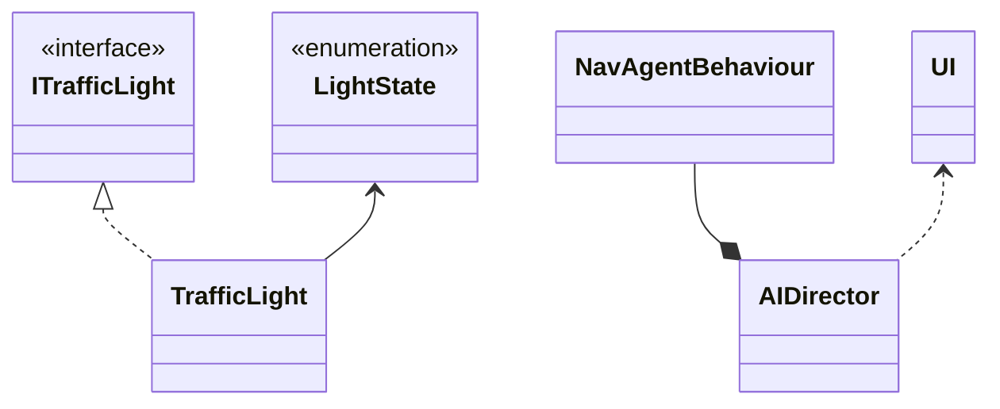

# Sim City

## Autoria

### Elementos do grupo

- Diogo Freire  22104684
- Steven Hall   2200173
  
### Report

#### Diogo Freire

- Código
  - NavAgentBehaviour:
    - Melhoria do comportamento do Agent
  - TrafficLight
  - AIDirector
- Scene:
  - _NavMesh Bake_
  - _NavMesh Link_
  - _Waypoints_ automóveis e peões
- Relatório:
  - Conclusão
  - Verificação ortográfica
- _Bug fixing_  

#### Steven Hall

- Código:
  - Implementação de FSM
  - AgentState enum
  - IAgent interface
  - TrafficLight System implementation:
    - LightState enum
    - TrafficLight class
    - ITrafficLight interface
  - UI
  - AIDirector
- Scene
  - Posicionamento de sinais de trânsito, transição de cor, _colliders_ e locais de destino
- Relatório:
  - UML
  - Diagramas
- _Bug fixing_

## Introdução

 O projeto desenvolvido consiste em uma simulação de automóveis e pedestres em uma cidade fictícia. Foi desenvolvido utilizando o motor de jogo [_Unity Engine_ 2022.3.1 _LTS_](https://unity.com/releases/editor/whats-new/2022.3.1#release-notes). O objetivo principal foi demonstrar as técnicas de Inteligência Artificial em uma espécie de _SimCity_ não jogável, com automóveis, peões e sinais de trânsito (sinalização luminosa).

- Objetivos desta simulação:
  - Fazer com que os automóveis respeitem as regras de trânsito, como sinais luminosos, passadeiras e outros veículos na via.
  - Permitir que os pedestres utilizem passeios e passadeiras quando o sinal luminoso permitir.
  - Simular acidentes entre agentes.
  - Implementar um modo de descontrole que escolhe um agente aleatório e aumenta o seu nível de "insanidade".
  
- Objetivos alcançados:
  - Implementação de sinais luminosos utilizando máquina de estados (_FSM_).
  - Transição entre estado de agentes (automóveis e peões).
  - Obedecer regras de trânsito
  - Estado descontrolo
  - Abrandar a para evitar colisões
  
## Estudo da Arte

Um importante referencial para a realização deste projeto é o famoso jogo _SimCity_, que possui diversas edições. Este jogo apresenta uma inteligência artificial bastante interessante, incluindo comboios, veículos elétricos, autocarros, alguns outros veículos e peões.

## Metodologia

A simulação desenvolvida é em 3D e as técnicas de Inteligência Artificial utilizadas foram, respectivamente, _FSM's_ (uma biblioteca essencial para a realização de transições entre estados) e _A* (Unity NavMesh)_, que é essencial para o _Pathfinding_ de agentes como carros e peões.

### Diagrama _FSM_ de agentes móveis

### Diagrama _FSM_ de sinais luminosos

### Diagrama Geral do Projeto em _UML_

## Resultados e discussão

Ao analisar a simulação, é possível observar que os agentes se deslocam para os seus alvos. Os semáforos (sinal luminoso) podem impedi-los de avançar e, se houver uma passadeira, os pedestres podem prosseguir, caso esta seja a situação na zona da simulação.

## Conclusões

Para concluir, o projeto desenvolvido consistiu em implementar uma simulação de trânsito com automóveis, peões e sinais luminosos. Os resultados obtidos na simulação foram:

- Respeito pelas regras de trânsito
- Uso com sucesso do NavMesh Link para cruzamentos
- Transições do estado dos agentes
- Alterações de estados os agentes a meio do programa
- Multiplos locais como destino
- Escolha ao calhas dos locais para destino
- Desaparecimento visual do agente, porem este mantem-se na cena

## Referências

### IAs generativas

O uso de IAs generativas foi usado e neste tópico explicaremos como:

- O _Chat Bing_ (_Chat GPT-4_) foi utilizado para tirar dúvidas e explicar itens da [documentação](https://learn.microsoft.com/en-us/dotnet/api/?view=netstandard-2.1) de forma mais clara e simples, erros, exemplos e também para obter de forma mais rápida _links_ com código útil, mas nunca diretamente utilizado no código do projeto.

A realização deste projeto consistiu essencialmente em pesquisa própria, conhecimento adquirido por meio de trabalhos e ensino fornecido por professores em diversas unidades curriculares lecionadas na [licenciatura de Videojogos](https://www.ulusofona.pt/lisboa/licenciaturas/videojogos).

### Código, tutoriais, planeamento utlizados e pesquisa

Technologies, U. (n.d.). Unity - Scripting API: Random.Range. <https://docs.unity3d.com/ScriptReference/Random.Range.html>
  
Sunny Valley Studio. (2020, August 26). Project setup - City Builder Unity tutorial P3 [Video]. YouTube. <https://www.youtube.com/watch?v=uBWEjqtdcgM>

Kink3d. (n.d.). GitHub - Kink3d/SimpleTraffic: A simple traffic simulation using Unity’s Nav Mesh Components. GitHub. <https://github.com/Kink3d/SimpleTraffic?tab=readme-ov-file>

Mike, V. a. P. B. (2012, October 1). SimCity: traffic system, public transportation and international airports. Simcitizens. <https://simcitizens.com/simcity-traffic-system-public-transportation-and-international-airports/>

### _Assets_ de terceiros
  
SimplePoly - Town Pack | 3D Environments | Unity Asset Store. (2024, January 7). Unity Asset Store. <https://assetstore.unity.com/packages/3d/environments/simplepoly-town-pack-62400>

School bus, simple, isometric | 3D Land | Unity Asset Store. (2020, November 16). Unity Asset Store. <https://assetstore.unity.com/packages/3d/vehicles/land/school-bus-simple-isometric-106250>

HD Low Poly Racing Car No.1201 | 3D Land | Unity Asset Store. (2024, March 16). Unity Asset Store. <https://assetstore.unity.com/packages/3d/vehicles/land/hd-low-poly-racing-car-no-1201-118603>

Microsimulation of traffic flow: Onramp. (n.d.). <https://www.traffic-simulation.de/>

Wikipedia contributors. (2024, March 15). Traffic simulation. Wikipedia. <https://en.wikipedia.org/wiki/Traffic_simulation>